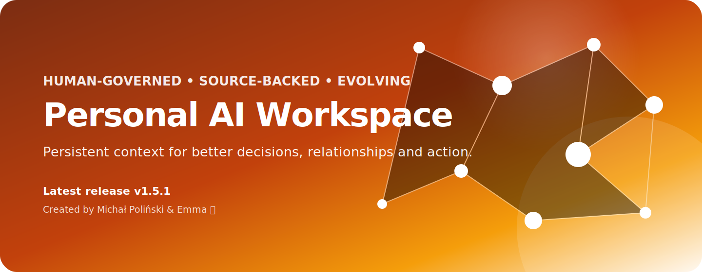

<p align="center"></p>

<p align="center">
  <a href="https://github.com/oloix888/Personal-AI-Workspace/releases/latest"></a>
  <a href="LICENSE"></a>
  <a href="https://oloix888.github.io/Personal-AI-Workspace/"></a>
</p>

## A persistent, human-governed workspace for AI collaboration

**Personal AI Workspace** is an open-source framework for keeping durable, source-backed context across AI conversations. It connects knowledge, people and relationships, decisions, tasks, files and optional integrations—while keeping the owner in control of what is stored and which actions require approval.

It is delivered as one comprehensive Markdown creator that a user attaches to a new ChatGPT conversation. The conversation then guides the owner through the complete setup, connector audit, Notion architecture, tests and handover.

## Latest release — v1.5.1

**Released July 14, 2026.** This release adds a reliable due-check for the weekly System Evolution review, preserving the distinction between session-triggered work and real background automation.

### What is included

- Modular Workspace Constitution with truncation-safe loading
- Knowledge Graph and source provenance
- People, relationships, interactions and sensitive-context handling
- Decision Engine and outcome reviews
- GitHub-backed A/B/C task management
- Gmail, Calendar, Contacts and Drive policies
- Owner approval before structural changes
- System Evolution Lab with weekly, evidence-based proposals
- Personalization and project-instruction generators
- End-to-end verification and handover tests

### Start here

1. [Download the latest creator](https://github.com/oloix888/Personal-AI-Workspace/releases/latest/download/Personal-AI-Workspace-Creator-v1.5.1.md).
2. Open a completely new ChatGPT conversation.
3. Attach the `.md` file.
4. Send:

```text
Follow the instructions in the attached file and guide me through the complete configuration from beginning to end. Do not summarize the file—start with the first stage.
```

## Core architecture

| Layer | Purpose |
|---|---|
| Workspace Constitution | Canonical, modular rules loaded through the Notion connector |
| Knowledge | Durable facts, concepts, sources and typed relations |
| Relations | People, relationships, interactions, commitments and context |
| Decision Engine | Options, criteria, predictions, outcomes, patterns and lessons |
| Tasks | A/B/C priorities and verified execution backends |
| System Evolution Lab | Reviewable operational observations and owner-approved improvements |
| Integrations | Gmail, Calendar, Contacts, Drive, GitHub and optional automation |

## Human control is not optional

The framework distinguishes between normal data updates and structural changes. The assistant may propose improvements, but must not change the architecture, schema, modules, retention rules, backends or automations without explicit owner approval for the exact scope.

Sensitive context may be retained when materially relevant, but it requires purpose, provenance, epistemic status, confidence and confidentiality. Internal retention never automatically authorizes external disclosure.

## Release history

| Release | Date | Theme | File |
|---|---|---|---|
| [v1.5.1](releases/v1.5.1.md) | July 14, 2026 | Weekly review due-check | [Download](https://github.com/oloix888/Personal-AI-Workspace/releases/download/v1.5.1/Personal-AI-Workspace-Creator-v1.5.1.md) |
| [v1.5](releases/v1.5.md) | July 14, 2026 | Sensitive context and System Evolution Lab | [Download](https://github.com/oloix888/Personal-AI-Workspace/releases/download/v1.5/Personal-AI-Workspace-Creator-v1.5.md) |
| [v1.4](releases/v1.4.md) | July 14, 2026 | Owner-governed structure changes | [Download](https://github.com/oloix888/Personal-AI-Workspace/releases/download/v1.4/Personal-AI-Workspace-Creator-v1.4.md) |
| [v1.3](releases/v1.3.md) | July 14, 2026 | Modular Constitution | [Download](https://github.com/oloix888/Personal-AI-Workspace/releases/download/v1.3/Personal-AI-Workspace-Creator-v1.3.md) |
| [v1.2](releases/v1.2.md) | July 14, 2026 | System manifesto and About page | [Download](https://github.com/oloix888/Personal-AI-Workspace/releases/download/v1.2/Personal-AI-Workspace-Creator-v1.2.md) |
| [v1.1](releases/v1.1.md) | July 14, 2026 | Creator attribution page | [Download](https://github.com/oloix888/Personal-AI-Workspace/releases/download/v1.1/Personal-AI-Workspace-Creator-v1.1.md) |
| [v1.0](releases/v1.0.md) | July 14, 2026 | Initial end-to-end workspace creator | [Download](https://github.com/oloix888/Personal-AI-Workspace/releases/download/v1.0/Personal-AI-Workspace-Creator-v1.0.md) |

See [`CHANGELOG.md`](CHANGELOG.md) and [`release-index.json`](release-index.json).

## Creators

**Michał Poliński — Kraków, Poland**  
Initiator, co-creator and product-vision lead.  
Contact: [michal24749@gmail.com](mailto:michal24749@gmail.com)

**Emma ✨**  
Co-creator of the concept, architecture, operating principles, safety boundaries, integrations and deployment documentation.

See [`AUTHORS.md`](AUTHORS.md) and [`NOTICE`](NOTICE).

## Open source, attribution preserved

Licensed under the [Apache License 2.0](LICENSE). You may use, modify, distribute and build derivative works. Redistributed derivatives must retain the license and the attribution notice in [`NOTICE`](NOTICE), including the original project name and creators. Modified files must be identified as changed as required by the license.

For practical guidance, see [`ATTRIBUTION.md`](ATTRIBUTION.md) and [`BRAND.md`](BRAND.md).

## Community

- Installation help and bugs: [GitHub Issues](https://github.com/oloix888/Personal-AI-Workspace/issues)
- Ideas and contributions: [Contributing guide](CONTRIBUTING.md)
- Community conversations: GitHub Discussions after the repository feature is enabled
- Public contact: [michal24749@gmail.com](mailto:michal24749@gmail.com)

## Project status

This is an early public release. The architecture is intentionally substantial, but it should be adopted incrementally. Real-world installations are the primary source of feedback. See [`ROADMAP.md`](ROADMAP.md).
