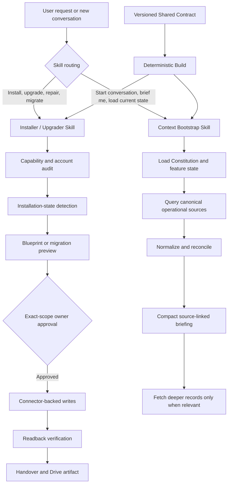
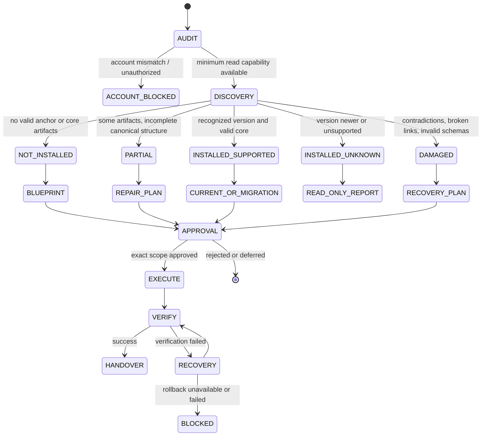

# Personal AI Workspace Skill Pack — Phase 1 Architecture Specification

**Status:** Draft for owner review  
**Date:** 2026-07-15  
**Target repository:** `oloix888/Personal-AI-Workspace`  
**Primary tracking issue:** `oloix888/Apex#12`  
**Related work:** Apex #6, #7, #8, #9, #10, #11  
**Original project creators:** Michał Poliński and Emma ✨

---

## 1. Executive decision

Phase 1 will ship **two separately installable Agent Skills**:

1. `personal-ai-workspace-installer-upgrader`
2. `personal-ai-workspace-context-bootstrap`

They will share one versioned public contract in the source repository, but every distributed skill package will be **self-contained**. A deterministic build step will vendor the required shared references into each final skill directory before packaging.

This design deliberately avoids both extremes:

- one monolithic skill that consumes too much context and mixes unrelated responsibilities;
- two manually duplicated skills whose rules drift over time.

The Markdown creator remains the universal fallback and onboarding artifact. The Skill Pack complements it; it does not replace it in Phase 1.

---

## 2. Product intent

The Skill Pack should make Personal AI Workspace repeatable in daily use:

- the installer/upgrader handles discovery, fresh installation, repair and version-aware migration;
- the context-bootstrap skill gives every new conversation a truthful, current operational briefing;
- both skills respect owner control, connector availability, feature state, privacy and readback verification;
- neither skill embeds private Emma Workspace identifiers or assumes one user's accounts.

The first stable release is successful only when an unrelated user can install the skills, configure their own accounts, create or upgrade a Workspace, and start a new conversation with useful current context without exposing the original creators' private environment.

---

## 3. Source requirements

This specification consolidates the approved requirements from Apex issue #12 and its dependencies:

- #6 — dedicated Installation / Getting Started documentation;
- #7 — existing-installation detection and version-aware upgrades;
- #8 — Context Bootstrap at conversation start;
- #9 — removal of active Google Tasks paths;
- #10 — verified Google Drive upload for final persistent artifacts;
- #11 — Feature & Integration Registry.

Current OpenAI platform constraints used by this design:

- a skill is a directory with required `SKILL.md` and optional `scripts/`, `references/`, `assets/` and `agents/openai.yaml`;
- `SKILL.md` requires `name` and `description` frontmatter;
- skill selection depends strongly on a concise, specific description;
- skills use progressive disclosure: metadata is visible before the full instructions are loaded;
- skills should remain focused on one job;
- instructions are preferred over scripts unless deterministic computation is required;
- `agents/openai.yaml` may configure presentation, invocation policy and tool dependencies;
- Personal Skills can be uploaded in ChatGPT where the account is eligible;
- Codex supports user-global skills under `$HOME/.agents/skills`;
- reusable bundles of multiple skills may later be distributed as a plugin.

Official references:

- https://help.openai.com/en/articles/20001066-skills-in-chatgpt
- https://learn.chatgpt.com/docs/build-skills
- https://learn.chatgpt.com/docs/build-plugins
- https://agentskills.io

---

## 4. Alternatives considered

### 4.1 One monolithic `personal-ai-workspace` skill

**Advantages**

- simplest installation story;
- one package and one version;
- no shared-contract build process.

**Disadvantages**

- combines structural installation with routine conversation startup;
- higher context cost whenever selected;
- broad descriptions increase accidental activation;
- harder testing and rollback;
- future memory, task, communications and artifact modules would make it increasingly unstable.

**Decision:** rejected.

### 4.2 Two fully independent skills with duplicated rules

**Advantages**

- independent packages;
- straightforward uploads;
- no runtime dependency between skills.

**Disadvantages**

- duplicated account, governance, privacy, version and capability rules drift easily;
- fixes must be applied in multiple places;
- difficult to prove cross-skill consistency.

**Decision:** rejected as the source architecture.

### 4.3 Two self-contained skills generated from a shared contract

**Advantages**

- focused activation and lower context cost;
- standalone installability;
- one source of truth for shared rules;
- deterministic package builds and drift checks;
- clean path to later plugin distribution.

**Disadvantages**

- requires a build step;
- source layout differs from final package layout;
- shared-contract compatibility must be versioned.

**Decision:** approved architecture.

---

## 5. Goals

### 5.1 Phase 1 goals

- deliver two valid, independently installable skills;
- support ChatGPT skill upload and Codex user-global installation;
- detect fresh, partial, supported, unknown and damaged installations;
- execute idempotent fresh installs and approved versioned upgrades;
- generate a current operational briefing at conversation start;
- respect enabled, disabled, unavailable, paused and degraded features;
- avoid active Google Tasks recommendations;
- upload final persistent artifacts to Google Drive when the capability is enabled and available;
- preserve Apache-2.0 licensing and original attribution;
- publish prerelease ZIPs, checksums and release notes in the public repository;
- provide deterministic tests and public-safe fixtures.

### 5.2 Non-goals

Phase 1 will not:

- implement a custom Notion, Gmail, Google Drive or GitHub connector;
- create an MCP server;
- guarantee background execution;
- replace the Markdown creator;
- ship the later memory, decisions, tasks, communications, artifacts or evolution specialist skills;
- migrate Michał's live private Workspace as part of public-skill development;
- publish private Emma Workspace IDs, account names, repositories, contacts or data;
- use Google Tasks as an active backend;
- automatically modify structure without exact-scope owner approval;
- package the two skills as a plugin before standalone validation succeeds.

---

## 6. System architecture



The skills orchestrate approved platform connectors. They do not implement connector protocols themselves.

---

## 7. Repository source layout

```text
skills/
├── _shared/
│   ├── contract/
│   │   ├── governance.md
│   │   ├── privacy-and-sensitive-context.md
│   │   ├── capability-model.md
│   │   ├── feature-registry-contract.md
│   │   ├── versioning-contract.md
│   │   ├── readback-contract.md
│   │   └── attribution.md
│   ├── schemas/
│   │   ├── capability-report.schema.json
│   │   ├── installation-report.schema.json
│   │   ├── migration-manifest.schema.json
│   │   ├── feature-registry.schema.json
│   │   └── context-briefing.schema.json
│   └── fixtures/
│       └── public-safe shared fixtures
│
├── personal-ai-workspace-installer-upgrader/
│   ├── SKILL.md
│   ├── agents/openai.yaml
│   ├── assets/
│   ├── references/
│   ├── scripts/
│   └── tests/
│
└── personal-ai-workspace-context-bootstrap/
    ├── SKILL.md
    ├── agents/openai.yaml
    ├── assets/
    ├── references/
    ├── scripts/
    └── tests/

skill-pack/
├── migrations/
│   ├── index.json
│   └── <from>-to-<to>/
├── scripts/
│   ├── build_skill_pack.py
│   ├── validate_skill_pack.py
│   ├── scan_private_identifiers.py
│   └── package_skill_pack.py
├── tests/
│   ├── contract/
│   ├── routing/
│   ├── installer/
│   ├── bootstrap/
│   └── security/
└── dist/
```

### 7.1 Distribution layout

Every final ZIP contains one skill root only:

```text
personal-ai-workspace-installer-upgrader/
├── SKILL.md
├── agents/openai.yaml
├── assets/
├── references/
└── scripts/
```

and separately:

```text
personal-ai-workspace-context-bootstrap/
├── SKILL.md
├── agents/openai.yaml
├── assets/
├── references/
└── scripts/
```

Shared references are copied into each package during build. Distributed packages must not depend on `../_shared` or any file outside their own root.

---

## 8. Version model

Four versions are tracked separately:

| Version | Meaning |
|---|---|
| Framework version | Public Personal AI Workspace creator / schema family, e.g. `1.5.1` |
| Skill Pack version | Release of the two-skill package, e.g. `0.1.0-beta.1` |
| Individual skill version | Version of one skill; initially equal to Skill Pack version |
| Installed workspace schema version | Version recorded inside the user's Constitution / manifest |

### 8.1 Compatibility declaration

Each Skill Pack release publishes a compatibility manifest:

```json
{
  "skill_pack_version": "0.1.0-beta.1",
  "supported_framework_versions": ["1.0", "1.1", "1.2", "1.3", "1.4", "1.5", "1.5.1"],
  "target_framework_version": "1.5.1",
  "minimum_contract_version": "1.0.0"
}
```

Unknown newer workspace versions must never be automatically downgraded.

---

## 9. Shared capability model

The skills use semantic capabilities rather than hard-coded connector function names.

```text
notion.identity.read
notion.content.read
notion.content.write
notion.database.create
notion.schema.modify

gmail.message.read
gmail.thread.read
gmail.draft.write
gmail.message.send

drive.folder.read
drive.file.upload
drive.file.readback

github.issue.read
github.issue.write
github.repository.read

calendar.event.read
calendar.event.write
contacts.read
contacts.write

automation.schedule.create
automation.schedule.read
```

The runtime capability audit maps the currently available tools to these semantic capabilities. Missing capabilities are reported; they are not invented.

### 9.1 Capability states

```text
AVAILABLE_READ_WRITE
AVAILABLE_READ_ONLY
UNAVAILABLE
UNAUTHORIZED
ACCOUNT_MISMATCH
DEGRADED
UNKNOWN
```

A skill may continue with reduced scope only when the resulting operation remains truthful and safe.

---

## 10. Feature & Integration Registry contract

The Skill Pack consumes the registry defined by Apex #11.

Required states:

```text
Enabled
Disabled by User
Unavailable
Pending Setup
Paused
Degraded
```

Each feature record must expose:

- stable feature key;
- display name;
- core or optional classification;
- owner decision and timestamp;
- required capabilities;
- dependencies;
- read and write scope;
- activation procedure;
- deactivation procedure;
- retention behavior while disabled;
- missed-sync behavior after re-enable;
- affected Constitution modules;
- health and error state.

Neither skill may silently enable a disabled feature during installation or upgrade.

---

# Part A — Installer / Upgrader Skill

## 11. Skill identity and activation

### 11.1 Proposed frontmatter

```yaml
---
name: personal-ai-workspace-installer-upgrader
description: Use when installing, detecting, repairing, migrating, or upgrading Personal AI Workspace. Trigger for fresh setup, existing-workspace discovery, version checks, partial installations, damaged installations, migration plans, and creator upgrades. Do not use for normal daily Workspace updates or conversation startup briefings.
---
```

### 11.2 Invocation policy

`allow_implicit_invocation: false` is recommended.

Reason: the skill can propose and execute structural changes after approval. It should be explicitly selected rather than invoked casually during an unrelated conversation.

### 11.3 Explicit examples

- Install Personal AI Workspace for me.
- Detect whether I already have Personal AI Workspace.
- Upgrade my Workspace from v1.4 to the current version.
- Repair a partial Personal AI Workspace installation.
- Migrate my Workspace without losing local customizations.

---

## 12. Installer state machine



### 12.1 State definitions

#### `NOT_INSTALLED`

No valid Constitution anchor and no convincing set of core artifacts.

#### `PARTIAL`

Some expected pages or databases exist, but the installation has no valid complete canonical structure. Examples:

- Constitution exists but module 00 is missing;
- core databases exist without Start Here;
- installation stopped halfway;
- duplicate partial structures exist.

#### `INSTALLED_SUPPORTED`

The installed version is recognized and required core components validate.

#### `INSTALLED_UNKNOWN`

A Workspace appears installed, but the version is unsupported, newer than the skill, or materially customized beyond the known migration model. Default behavior is read-only analysis and a manual migration proposal.

#### `DAMAGED`

The canonical structure is contradictory or unusable. Examples:

- duplicate anchors claim to be canonical;
- module registry points to missing pages;
- required schema properties have incompatible types;
- identity metadata conflicts;
- migration was interrupted and rollback state is ambiguous.

---

## 13. Discovery algorithm

The installer must discover by content and schema signature, never by private IDs.

### 13.1 Discovery order

1. verify connector identity and account;
2. search for likely Constitution pages by title and known structural markers;
3. inspect Start Here and module registry candidates;
4. inspect version metadata;
5. inspect core databases by title plus required property signatures;
6. inspect Feature & Integration Registry;
7. inspect Task Outbox and System Evolution Lab when present;
8. identify duplicates and local customizations;
9. produce an evidence-linked installation report.

### 13.2 Evidence requirements

Every classification must include:

- matched artifacts;
- missing artifacts;
- conflicting artifacts;
- detected versions;
- connector coverage;
- confidence;
- reason for the classification.

The installer must not classify solely from one page title.

---

## 14. Structural approval gate

No structural write occurs before the user receives a preview containing:

- current state;
- target state;
- exact pages, databases, fields, modules, integrations and automations affected;
- additions, removals, renames and migrations;
- preserved local customizations;
- risks and counterarguments;
- data-copy or data-loss risk;
- expected duration and connector dependencies;
- rollback checkpoint;
- post-change verification plan.

Approval authorizes only the displayed scope. Newly discovered scope requires re-confirmation.

---

## 15. Migration system

### 15.1 Declarative migration manifest

Each migration directory contains:

```text
migration.json
preconditions.md
operations.md
validation.md
rollback.md
fixtures/
```

Example manifest:

```json
{
  "id": "1.4-to-1.5",
  "from": "1.4",
  "to": "1.5",
  "destructive": false,
  "requires": ["notion.content.read", "notion.content.write"],
  "preconditions": ["single-canonical-constitution"],
  "operations": [
    "add-sensitive-context-policy",
    "create-system-evolution-lab"
  ],
  "validations": [
    "constitution-readback",
    "lab-schema-valid",
    "workspace-index-updated"
  ],
  "rollback": "archive-created-lab-and-restore-constitution-snapshot"
}
```

### 15.2 Sequential upgrades

Upgrades run one supported migration at a time:

```text
1.2 → 1.3 → 1.4 → 1.5 → 1.5.1
```

Skipping migrations is prohibited unless a dedicated direct migration exists and is tested.

### 15.3 Idempotency

Every operation has a stable idempotency key derived from:

```text
workspace identity + migration ID + operation key
```

Before creating an artifact, the installer searches for an existing matching canonical artifact and validates it. Reruns update or resume; they do not create duplicates.

### 15.4 Rollback

Before execution, create a migration checkpoint containing:

- discovered artifact map;
- versions and schema signatures;
- source URLs;
- intended operation list;
- reversible copies or exports where supported;
- rollback instructions;
- user approval record.

If Google Drive is enabled and upload capability exists, final checkpoint and handover artifacts must be uploaded and verified. If mandatory upload policy is active but upload fails, the migration may complete technically, but the workflow status remains `ARTIFACT_ARCHIVE_INCOMPLETE` and a follow-up task is created.

---

## 16. Fresh installation flow

1. capability and account audit;
2. module selection and Feature Registry preview;
3. complete structural blueprint;
4. exact-scope owner approval;
5. create root, Constitution index, modules and Start Here;
6. create approved databases in dependency order;
7. create Feature & Integration Registry;
8. create attribution and About pages;
9. configure enabled integrations only;
10. create initial Context Bootstrap test data only when explicitly marked as test and cleaned up afterward;
11. execute end-to-end verification;
12. generate personalization and project-instruction snippets using real title and URL;
13. create handover report;
14. upload final persistent artifacts to the owner's Drive when enabled and available;
15. record implementation result and review date.

---

## 17. Installer outputs

### 17.1 Machine-readable outputs

- capability report;
- installation report;
- approved blueprint;
- migration execution log;
- verification report;
- handover manifest.

### 17.2 User-facing outputs

- concise state summary;
- exact approval request;
- progress and blocked items;
- final links;
- personalization text;
- project-instruction text;
- list of disabled/unavailable features;
- rollback and support instructions.

---

# Part B — Context Bootstrap Skill

## 18. Skill identity and activation

### 18.1 Proposed frontmatter

```yaml
---
name: personal-ai-workspace-context-bootstrap
description: Use at the beginning of a new conversation, or when the user asks for current Workspace context, active tasks, priorities, commitments, project state, pending reviews, risks, or a briefing. Load Personal AI Workspace Constitution first, then build a compact source-linked operational briefing. Do not use for installation, migration, repair, or structural changes.
---
```

### 18.2 Invocation policy

`allow_implicit_invocation: true` is recommended.

The skill should be available for automatic use when the request clearly asks for current context. Project instructions and Personalization remain the stronger guarantee for always attempting the bootstrap at new-conversation start.

### 18.3 Explicit examples

- Load my Personal AI Workspace context.
- Brief me on my active tasks and projects.
- What is currently blocked or overdue?
- Start this conversation with my Workspace briefing.
- Refresh the current operational context.

---

## 19. Bootstrap workflow

1. verify Notion identity;
2. load Constitution index, Start Here and module 00;
3. read Feature & Integration Registry;
4. determine enabled and available sources;
5. query canonical active-state sources;
6. normalize records;
7. reconcile duplicate and conflicting states;
8. calculate freshness and coverage;
9. generate a compact source-linked briefing;
10. fetch full detail only for records relevant to the user's opening request;
11. report missing, stale, truncated or conflicting coverage.

The bootstrap is read-only by default. It may write only when a separate approved workflow requires refreshing a persistent cache or recording a detected inconsistency.

---

## 20. Canonical briefing schema

```json
{
  "generated_at": "2026-07-15T09:00:00+02:00",
  "workspace": {
    "title": "Example Workspace",
    "framework_version": "1.5.1",
    "constitution_url": "https://..."
  },
  "coverage": {
    "status": "FULL|PARTIAL|DEGRADED",
    "sources_checked": [],
    "sources_unavailable": [],
    "truncated": false,
    "notes": []
  },
  "features": [],
  "tasks": [],
  "projects": [],
  "commitments": [],
  "reviews": [],
  "risks": [],
  "contradictions": [],
  "recent_material_changes": [],
  "high_value_facts": []
}
```

### 20.1 Task record

Every active task must expose:

```text
id
title
priority
status
execution_owner
outcome_or_description
due_date
blocked_by
waiting_for_confirmation
source
backend_url
last_updated
freshness
```

All active A/B/C and recurring tasks are represented. Historical closed tasks are summarized only when recently completed or relevant.

---

## 21. Source priority and reconciliation

Source priority is configured, not hard-coded. The Feature Registry defines which system is canonical for each field.

Example task policy:

```text
Task definition and provenance → Notion Task Outbox
Execution state and closure → GitHub Issue
Meeting time block → Calendar event
```

When sources disagree:

- preserve both values;
- identify timestamps and source URLs;
- mark `CONFLICTING_STATE`;
- do not silently choose a winner unless the configured field-level precedence resolves it;
- surface high-impact conflicts in the briefing.

---

## 22. Context budget and completeness

Default output target: **8,000 tokens or fewer**.

Allocation:

- up to 75% for active tasks when task volume is high;
- remaining budget for projects, commitments, reviews, risks, changes and feature state.

Completeness rules:

- every active task must appear at least as a compact index row;
- if full task descriptions exceed budget, switch to `TASK_INDEX_MODE`;
- deeper descriptions are loaded on demand;
- no silent omission;
- if even the compact task index exceeds the available context, split the briefing into numbered continuations and state coverage explicitly.

The briefing optimizes for current operational awareness, not archival completeness.

---

## 23. Freshness model

Each source and normalized record receives:

```text
FRESH
AGING
STALE
UNKNOWN
```

Default thresholds are configurable by source type. A stale cached record may be displayed only with its stale marker and source date.

`last refreshed` always refers to the actual successful source read, not the time the response was generated.

---

## 24. Sensitive context in briefing

The bootstrap includes sensitive context only when necessary for the current operational state.

Rules:

- never include authentication secrets;
- prefer a redacted pointer to the canonical Confidential record;
- include the minimum detail needed for action;
- do not externalize sensitive content into shared tasks or public outputs;
- preserve epistemic status and confidence;
- user-disabled sensitive-context loading must be respected.

---

## 25. Bootstrap outputs

### 25.1 Default human-readable briefing

1. coverage and freshness header;
2. urgent and overdue items;
3. active A tasks;
4. remaining active tasks by priority;
5. blocked and waiting items;
6. active projects;
7. commitments and follow-ups;
8. pending reviews;
9. critical risks and contradictions;
10. recent material changes;
11. disabled or degraded capabilities;
12. source links and deeper-fetch options.

### 25.2 Machine-readable option

When useful, the skill may produce the canonical briefing JSON as an attached artifact. If it becomes a persistent user-facing file, the final artifact follows the verified Drive upload policy.

---

## 26. Error handling

### 26.1 Wrong account

- stop operations for that service;
- show expected and observed identity;
- do not read or write personal data from the wrong account.

### 26.2 Connector unavailable or unauthorized

- mark capability state;
- continue only with truthful reduced scope;
- describe the missing coverage.

### 26.3 Truncated connector response

- mark the affected source incomplete;
- paginate, query a narrower range or load smaller modules;
- never claim full coverage.

### 26.4 Write verification failure

Installer:

- stop dependent writes;
- retry only when safe;
- run rollback or mark blocked;
- do not report success.

Bootstrap:

- normally read-only; any optional cache write failure does not invalidate the briefing, but must be reported.

### 26.5 Unsupported or newer installation

- remain read-only;
- produce a compatibility report;
- do not downgrade or rewrite;
- request a manually reviewed migration specification.

### 26.6 Conflicting canonical records

- preserve both;
- report the conflict;
- create a review item only under an approved normal-data workflow.

---

## 27. Scripts policy

Instructions orchestrate connector calls. Scripts are used only for deterministic local operations such as:

- validating package structure and frontmatter;
- validating JSON schemas;
- classifying installation reports from supplied fixture JSON;
- calculating migration paths;
- normalizing and sorting briefing records from supplied JSON;
- scanning for private identifiers and secrets;
- building ZIP packages and checksums.

Scripts must not:

- contain private IDs;
- contain credentials;
- independently call personal cloud services;
- bypass owner approval;
- claim connector access;
- silently mutate a live Workspace.

---

## 28. `agents/openai.yaml` design

### 28.1 Installer / upgrader

```yaml
interface:
  display_name: "Personal AI Workspace Installer & Upgrader"
  short_description: "Install, detect, repair, or upgrade Personal AI Workspace safely"
  brand_color: "#EA580C"
  default_prompt: "Inspect my environment and prepare a safe Personal AI Workspace installation or upgrade plan."
policy:
  allow_implicit_invocation: false
```

### 28.2 Context bootstrap

```yaml
interface:
  display_name: "Personal AI Workspace Context Bootstrap"
  short_description: "Load current tasks, projects, commitments, reviews, risks, and feature state"
  brand_color: "#F59E0B"
  default_prompt: "Load my Personal AI Workspace and brief me on the current operational state."
policy:
  allow_implicit_invocation: true
```

Tool dependencies should be declared only when stable supported dependency identifiers are known. The skill instructions must still capability-audit at runtime.

---

## 29. Security and public/private boundary

The repository and packages must be scanned for:

- private Notion IDs and URLs;
- private Google account or Drive folder IDs;
- `oloix888/Apex` references inside public runtime packages;
- email addresses other than the intentionally public project contact;
- names of private contacts;
- Gmail subjects or bodies;
- personal projects and relationship data;
- tokens, cookies, API keys and passwords;
- private Emma Workspace manifests;
- generated test output containing real connector responses.

Fixtures use fictional people, accounts, URLs and IDs.

The packages preserve:

- project name `Personal AI Workspace`;
- original creator attribution;
- Apache-2.0 license;
- NOTICE requirements.

---

## 30. Test strategy

### 30.1 Package contract tests

- required `SKILL.md` exists;
- valid frontmatter with exact names;
- descriptions contain positive and negative trigger boundaries;
- `agents/openai.yaml` validates;
- every distributed reference is internal to the skill root;
- no broken relative links;
- no private identifiers or secrets;
- NOTICE and attribution included where required.

### 30.2 Routing tests

Positive and negative prompts verify skill selection.

Installer positive examples:

- upgrade my Personal AI Workspace;
- repair my incomplete installation.

Installer negative examples:

- show my active tasks;
- draft an email.

Bootstrap positive examples:

- load my current Workspace context;
- what is blocked today?

Bootstrap negative examples:

- install Personal AI Workspace;
- change my Notion schema.

### 30.3 Installer fixture matrix

- `NOT_INSTALLED`;
- `PARTIAL`;
- supported old version;
- current version;
- unsupported newer version;
- damaged duplicate anchors;
- interrupted migration;
- disabled optional modules;
- unavailable connector;
- account mismatch.

### 30.4 Migration tests

- correct sequential path;
- idempotent rerun;
- preservation of custom pages and fields;
- approval boundary;
- scope expansion stop;
- rollback plan availability;
- readback failure;
- Drive upload incomplete state;
- no Google Tasks active path.

### 30.5 Bootstrap fixture matrix

- no active tasks;
- normal task volume;
- more than 50 active tasks;
- overdue and blocked tasks;
- waiting-for-confirmation tasks;
- recurring tasks;
- conflicting GitHub and Notion states;
- stale source;
- partial connector access;
- truncated response;
- disabled features;
- pending reviews;
- sensitive linked context;
- recent completions.

### 30.6 End-to-end tests

1. upload each skill into an eligible ChatGPT Skills environment;
2. install each skill separately;
3. verify explicit invocation;
4. verify intended implicit behavior;
5. run fresh install against a disposable test Workspace;
6. run supported upgrade against a disposable copied Workspace;
7. start a new conversation and validate the briefing;
8. install user-globally in Codex;
9. verify `$skill` discovery and execution;
10. download installed skills and compare package integrity.

No live private Workspace migration is part of these tests.

---

## 31. Build and release pipeline

### 31.1 Build

1. validate shared contract;
2. copy required shared references into each skill;
3. generate version metadata;
4. validate package-local links;
5. run private-data and secret scans;
6. run unit and fixture tests;
7. create standalone ZIPs;
8. create combined Skill Pack ZIP containing both standalone ZIPs plus manifest;
9. create SHA-256 checksums;
10. generate release notes.

### 31.2 Proposed prerelease artifacts

```text
Personal-AI-Workspace-Installer-Upgrader-0.1.0-beta.1.zip
Personal-AI-Workspace-Context-Bootstrap-0.1.0-beta.1.zip
Personal-AI-Workspace-Skill-Pack-0.1.0-beta.1.zip
SHA256SUMS.txt
```

### 31.3 Release policy

- publish first as GitHub prerelease;
- keep creator v1.5.1 as the recommended universal fallback;
- mark stable only after pilot success criteria are met;
- do not silently replace existing release assets.

---

## 32. Pilot and stability criteria

Recommended pilot cohort:

- one fresh installation;
- one partial installation;
- one supported upgrade;
- one Codex user-global installation;
- one ChatGPT upload/install on every available supported surface.

Stable release requires:

- no data loss;
- no duplicate core pages or databases after rerun;
- no structural write without approval;
- no private identifier in public packages;
- truthful connector coverage in every run;
- successful context briefing with all active tasks indexed;
- successful rollback or documented safe block in failure tests;
- at least three external pilot sessions with no critical defect;
- implementation result and follow-up review recorded in System Evolution Lab.

---

## 33. Observability and System Evolution

Every test or pilot may produce public-safe operational observations:

- trigger mismatch;
- connector capability mismatch;
- installation misclassification;
- migration failure;
- duplicate creation;
- stale briefing;
- omitted active task;
- context budget failure;
- false success claim;
- user confusion.

Observations are clustered before proposals. A single low-impact incident does not justify a redesign unless it reveals critical safety, privacy or data-integrity risk.

Implementation changes remain owner-governed.

---

## 34. Documentation requirements

Before prerelease, the public repository must add:

- dedicated Installation / Getting Started page from Apex #6;
- Skill Pack overview;
- separate install instructions for ChatGPT and Codex;
- fresh install versus upgrade decision guide;
- capability and connector checklist;
- feature enable/disable guide;
- privacy and public/private boundary;
- troubleshooting;
- release and compatibility matrix;
- fallback path using the Markdown creator.

---

## 35. Acceptance-criteria traceability

| Apex #12 criterion | Specification coverage |
|---|---|
| Two separately installable skills | Sections 1, 7, 31 |
| Valid frontmatter and discovery | Sections 11, 18, 28, 30 |
| No private identifiers | Sections 29, 31 |
| Installation-state fixtures | Sections 12, 30 |
| Bootstrap scale/conflict/partial tests | Sections 20–24, 30 |
| Feature toggles | Sections 9, 10 |
| Idempotent reruns | Sections 13–15, 30 |
| Approval, rollback and readback | Sections 14–16, 26, 30 |
| ChatGPT and Codex installation | Sections 30, 34 |
| Public ZIPs, checksums and notes | Section 31 |
| Apache-2.0 and attribution | Section 29 |
| Compatibility tests | Sections 30–32 |
| Public site links without replacing creator | Sections 31, 34 |
| Evolution review | Sections 32–33 |

---

## 36. Risks and mitigations

| Risk | Mitigation |
|---|---|
| Skill descriptions activate incorrectly | Positive/negative routing fixtures; focused descriptions |
| Shared rules drift | One shared source; deterministic vendoring; content hashes |
| Connector names differ by surface | Semantic capability model and runtime audit |
| User uploads only one of the two skills | Each package is standalone; documentation explains combined benefit |
| Installer changes live data incorrectly | Explicit invocation, preview, exact approval, idempotency, readback and rollback |
| Context briefing becomes huge | Task index mode, adaptive budget, links and on-demand depth |
| Cached data becomes stale | Per-source freshness and actual refresh timestamp |
| Unknown newer Workspace is damaged by downgrade | Read-only `INSTALLED_UNKNOWN` path |
| Private data enters public package | automated scans, fictional fixtures and manual security review |
| Drive connector cannot upload exact artifact | explicit incomplete state and follow-up task; no false success |
| Skills are unavailable on a user's plan or surface | Markdown creator remains the supported fallback |

---

## 37. Implementation order after approval

1. create shared schemas and contract tests;
2. create build and privacy-scan pipeline;
3. implement installer/upgrader instruction skeleton and state classifier;
4. implement migration manifest framework and fixtures;
5. implement context-bootstrap instruction skeleton and normalization model;
6. implement briefing fixtures and budget behavior;
7. package standalone ZIPs;
8. run ChatGPT and Codex install tests;
9. publish `0.1.0-beta.1` prerelease;
10. run external pilots;
11. review findings before stable release.

---

## 38. Owner review decision requested

Approval of this specification authorizes creation of an implementation plan only. It does **not** authorize:

- code or skill implementation;
- public prerelease publication;
- modification of Michał's live private Workspace;
- migration of existing user installations;
- creation of new live Notion structures.

Any material change to the two-skill boundary, shared-contract strategy, migration model, approval rules, public/private boundary or rollout policy must return for owner review.
